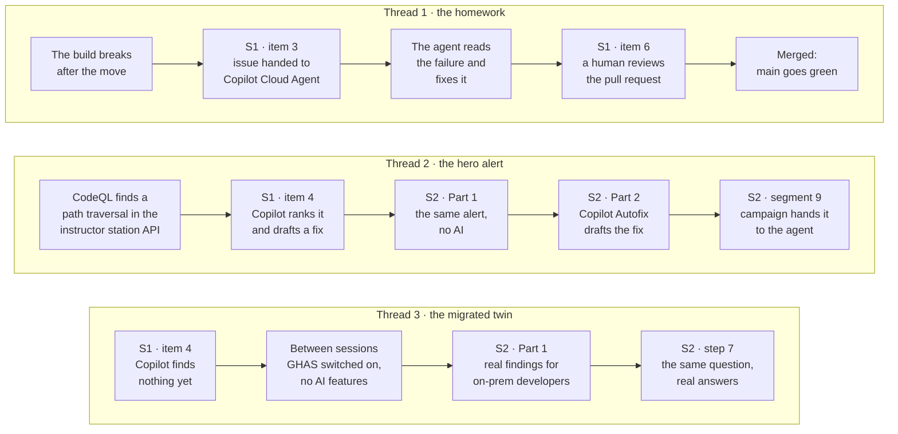
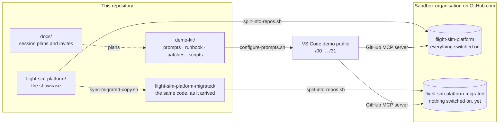
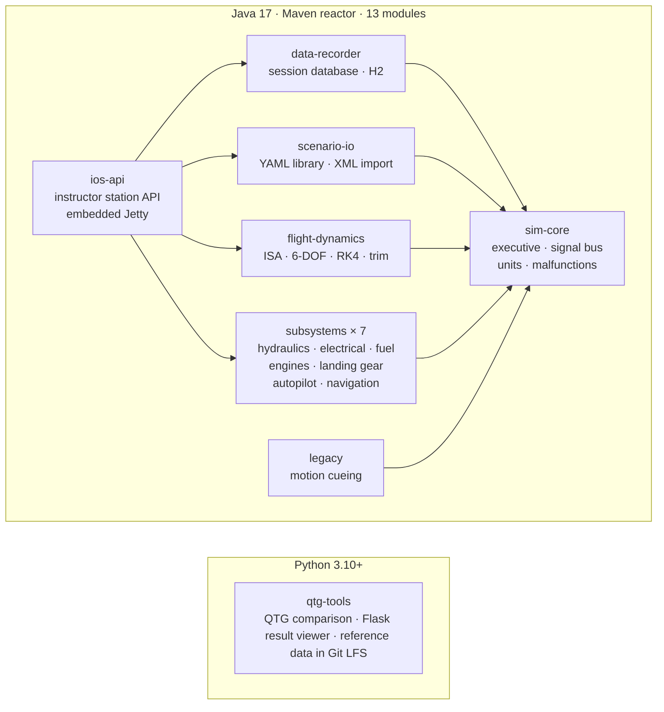
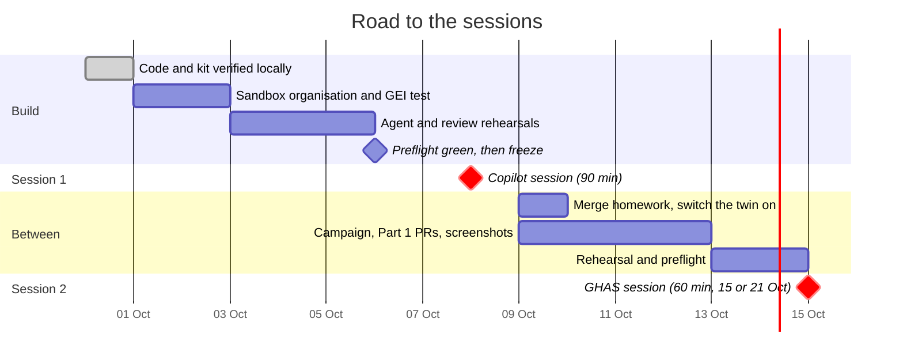

<div align="center">

# ✈️ GHES → GHEC: Copilot & GHAS developer enablement

**Curated GitHub Copilot and GitHub Advanced Security training for developers moving from GitHub Enterprise Server to GitHub Enterprise Cloud.**

A realistic demo codebase, its "just migrated" twin, and a numbered prompt spine that runs every demo in the same order, every time.

[](flight-sim-platform)
[](flight-sim-platform/pom.xml)
[](flight-sim-platform/python/qtg-tools)
[](#-whats-planted-and-where)
[](demo-kit/prompts)
[](#-proven-not-promised)

[**Quick start**](#-quick-start) · [**The story**](#-the-story-in-one-picture) · [**Sessions**](#-the-sessions) · [**Prompt spine**](#-the-prompt-spine) · [**Runbook**](demo-kit/RUNBOOK.md)

</div>

---

## ✨ At a glance

| | |
|---|---|
| 🎓 **Two sessions** | A 90-minute Copilot session on what changes when repositories land on GitHub.com, then a 60-minute GHAS session in two halves: one for everyone, one for cloud only |
| 🪞 **Two demo repositories** | [`flight-sim-platform`](flight-sim-platform), the showcase with everything switched on, and [`flight-sim-platform-migrated`](flight-sim-platform-migrated), the same code as it arrived |
| 🛩️ **A codebase that feels inherited** | 13 Maven modules and a Python tool: a six-degree-of-freedom flight model, seven aircraft systems with 41 malfunctions, an instructor station API, a flight data recorder and qualification tooling with Git LFS data |
| 🔎 **Findings that are really there** | 15 CodeQL alerts, 44 published advisories against pinned dependencies, two kinds of secret, a pull request with eight review-worthy defects, and a build broken exactly the way a migration breaks it |
| 🤖 **A demo that drives itself** | 20 numbered prompt files, from `/00-reset-demo-state` to `/31-review-the-campaign-pr`, each allowed only the tools it needs |
| ✅ **Proven, not promised** | 90 tests green, the CodeQL results reproduced locally, and the homework fix verified end to end |

> [!IMPORTANT]
> **Four folders, two destinations.** `flight-sim-platform/` and `flight-sim-platform-migrated/` become standalone repositories in a sandbox organisation. `demo-kit/` and `docs/` stay here and never appear on screen.

## Contents

- [The story in one picture](#-the-story-in-one-picture)
- [What's in the box](#%EF%B8%8F-whats-in-the-box)
- [The sessions](#-the-sessions)
- [The prompt spine](#-the-prompt-spine)
- [Inside the showcase](#%EF%B8%8F-inside-the-showcase)
- [What's planted, and where](#-whats-planted-and-where)
- [Quick start](#-quick-start)
- [Proven, not promised](#-proven-not-promised)
- [From folders to repositories](#-from-folders-to-repositories)
- [Design decisions](#-design-decisions)
- [Guardrails](#%EF%B8%8F-guardrails)
- [Road to the sessions](#%EF%B8%8F-road-to-the-sessions)
- [Documentation](#-documentation)

---

## 🧭 The story in one picture

Three threads start in session 1 and pay off in session 2. Each one is backed by something real in the demo repositories, not by a slide.



| Thread | Why it lands |
|---|---|
| **The homework** | The build breaks the way a real migration breaks it: a build file still fetches its coding standard from the old server. Pointing it at github.com doesn't help either, so the agent has to read the error and switch to the vendored copy. It is the attendees' own migration task, done in front of them |
| **The hero alert** | One path traversal, followed from Copilot's first ranking to a security campaign pull request. The room sees "same engine, AI on top" instead of being told it |
| **The migrated twin** | The same Copilot question gets *nothing* in session 1 and real answers in session 2, because the repository really had nothing switched on — just like the ones the attendees just moved |

## 🗂️ What's in the box



| Folder | What it is | Where it ends up |
|---|---|---|
| [`flight-sim-platform/`](flight-sim-platform) | **The showcase.** A fictional FS-200 full-flight training simulator in Java 17 and Maven, plus a Python qualification tool. Ships with Copilot instructions, CODEOWNERS, `copilot-setup-steps.yml` and the MCP configuration | Its own repository in the sandbox organisation, everything switched on |
| [`flight-sim-platform-migrated/`](flight-sim-platform-migrated) | **The twin.** The same code as it arrived from GHES, with no Copilot files and nothing GitHub.com-only. Generated by a script; never edit it by hand | Its own repository, switched on between the sessions |
| [`demo-kit/`](demo-kit) | **The engine room.** Numbered prompts, the runbook, branch patches, the homework issue and its answer key, governance templates and scripts | Stays here, never on screen |
| [`docs/`](docs) | Programme overview, session plans and invites | Stays here, internal |

<details>
<summary><b>Full tree</b></summary>

```text
ghes-to-ghec-copilot-and-ghas/
├── docs/                              programme overview, session plans and invites
├── flight-sim-platform/               the showcase
│   ├── sim-core/                      executive, signal bus, units, maths, malfunction registry
│   ├── flight-dynamics/               ISA atmosphere, aerodynamics, 6-DOF equations of motion, trim
│   ├── subsystems/                    hydraulics, electrical, fuel, engines, landing gear, autopilot, navigation
│   ├── scenario-io/                   scenario library, IOS v2 XML import, scenario packs
│   ├── data-recorder/                 session database and flight data recorder
│   ├── ios-api/                       instructor operator station HTTP API on embedded Jetty
│   ├── legacy/                        code ported from the previous simulator host
│   ├── python/qtg-tools/              QTG comparison, Flask result viewer, reference data in Git LFS
│   ├── build-tools/                   vendored coding standards (the homework's answer)
│   ├── training-data/                 sample scenarios and approach charts
│   ├── docs/                          architecture, ADRs, the move to GitHub.com
│   ├── scripts/                       run the IOS locally, release notes, the SPL step
│   ├── Jenkinsfile, ci/               Jenkins stays: builds and publishes through Artifactory
│   ├── .github/                       Copilot instructions, CODEOWNERS, setup steps, issue template
│   └── .vscode/mcp.json               the GitHub MCP server with the security toolsets
├── flight-sim-platform-migrated/      generated twin: no Copilot, nothing GitHub.com-only
└── demo-kit/
    ├── RUNBOOK.md                     sandbox setup, timeline, run sheets, troubleshooting
    ├── prompts/                       00 to 31, run in filename order
    ├── branches/                      feature/gust-model, feature/scenario-pack-import, chore/dependabot-artifactory
    ├── issues/                        the build-migration issue handed to the cloud agent
    ├── governance/                    custom property, ruleset and required workflows
    ├── answer-keys/                   the expected homework fix, and a script that proves it
    └── scripts/                       sync the twin, configure prompts, split into repos, verify CodeQL
```

</details>

## 🎓 The sessions

### Session 1 · Your repositories on GitHub.com — 90 minutes

| # | Item | Min | What the room sees | Prompts |
|---|---|---:|---|---|
| 1 | What changed, and what didn't | 4 | One move, three consequences. Jenkins stays | — |
| 2 | Teams, permissions and repository administration | 13 | Getting your bearings in an inherited repository; CODEOWNERS still naming the old per-project organisations | `10` |
| 3 | Actions and CI/CD | 12 | `copilot-setup-steps.yml` (hosted or self-hosted runners, Git LFS on), then the build-migration issue handed to the cloud agent | `11` |
| 4 | **GHAS + Copilot: better together** ⭐ | 16 | The MCP configuration on screen; Copilot ranks real CodeQL alerts and drafts a fix; the migrated repository returns nothing | `12` `13` `14` `15` |
| 5 | Copilot Code Review | 15 | Request a review, read the severity labels, apply a suggestion, **Fix with Copilot** | `16` |
| 6 | Copilot Cloud Agent | 15 | The agent's session log: the build fails, it reads the error, fixes it, and a human reviews the pull request | `17` |
| 7 | Copilot beyond the editor | 6 | Copilot on GitHub.com, a Copilot Space, the GitHub Copilot App | `18` |
| 8 | What actually uses AI credits | 4 | — | — |
| 9 | Wrap, champions and office hours | 5 | The take-away prompt | `19` |

### Session 2 · GitHub Advanced Security, on-prem and on GitHub.com — 60 minutes

**Part 1 · everyone (30 min).** Screenshots, and nothing that only GitHub.com has.

| # | Segment | Min | What the room sees |
|---|---|---:|---|
| 1 | The same product on both | 2 | — |
| 2 | The three pillars | 11 | One pull request with a new CodeQL alert *and* a vulnerable dependency; a Dependabot alert and its pull request; a custom-pattern secret; Dependabot `registries` for Artifactory |
| 3 | Is it on? Steps 1–3 of the check | 6 | Security settings, Tool status and the dependency graph |
| 4 | Turning it on | 6 | Default setup, and a setting held by an enforced configuration |
| 5 | Wrap-up and questions | 5 | Three minutes of questions, answered from Part 1 screenshots only |

**Part 2 · cloud only (30 min).** Live.

| # | Segment | Min | What the room sees | Prompts |
|---|---|---:|---|---|
| 6 | What didn't come across | 5 | The migrated repository: no configuration, no custom properties, no rules. It looks fine and is governed by nothing | — |
| 7 | What GitHub.com adds | 11 | Scanning on hosted runners next to Jenkins; Copilot Autofix on the hero alert; an AI-detected password; Copilot Chat on an alert | — |
| 8 | The rest of the check, steps 4–7 | 6 | Rulesets and required workflows, then session 1's Copilot question again — with answers this time | `30` |
| 9 | Autofix → campaign → cloud agent | 5 | A security campaign hands the hero alert to Copilot Cloud Agent, and a human reviews its pull request | `31` |
| 10 | Wrap, champions and office hours | 3 | The take-away prompt | `19` |

## 🤖 The prompt spine

Every demo step is a [VS Code prompt file](https://code.visualstudio.com/docs/copilot/customization/prompt-files) with a numbered filename. The presenter types `/`, picks the next number, and the demo runs the same way in rehearsal and on the day. The first digit is the phase, and the gaps leave room for new steps without renumbering.

| Phase | Prompts |
|---|---|
| `0` · prep | `00-reset-demo-state` · `01-seed-demo-backlog` · `02-preflight-check` |
| `1` · session 1 | `10-orient-in-inherited-repo` · `11-hand-homework-to-cca` · `12-what-does-copilot-see` · `13-explain-and-draft-a-fix` · `14-dependencies-and-secrets` · `15-same-question-just-migrated` · `16-open-pr-for-review` · `17-review-the-agents-pr` · `18-beyond-the-editor` *(browser)* · `19-homework-ask-what-copilot-sees` *(take-away)* |
| `2` · between sessions | `20-build-part-1-pull-requests` · `21-create-security-campaign` · `22-mirror-governance-pattern` · `28-reset-session-2` · `29-preflight-session-2` |
| `3` · session 2 | `30-what-does-copilot-see-now` · `31-review-the-campaign-pr` |

Each prompt names its agent and only the tools it needs. Session 1's headline question can read code scanning alerts and nothing else:

```markdown
---
description: "Session 1, item 4: what CodeQL findings are open on this repo, and which should I fix first?"
agent: agent
tools: ['github/list_code_scanning_alerts', 'github/get_code_scanning_alert']
---
What CodeQL findings are open on `DEMO_ORG/flight-sim-platform`, and which should I fix first?

How to answer — this is on a projector:
- Use the repository's code scanning alerts (state open, tool CodeQL). Don't read the source code to guess.
- One table: severity, rule, file, count. Java first, then Python.
- Then **Fix first**: the top three, each with file and line and one sentence on why — whether it is reachable from the instructor station's HTTP API or the QTG viewer, its severity, and what an attacker could do with it.
- No more than 20 lines.
```

The security toolsets aren't among the GitHub MCP server's defaults, so the showcase ships the configuration people will want to screenshot:

```json
{
  "servers": {
    "github": {
      "type": "http",
      "url": "https://api.githubcopilot.com/mcp/",
      "headers": {
        "X-MCP-Toolsets": "context,repos,issues,pull_requests,users,code_security,secret_protection,dependabot,copilot"
      }
    }
  }
}
```

> [!TIP]
> `X-MCP-Toolsets` **replaces** the default toolsets instead of adding to them. That's why the list repeats `context,repos,issues,pull_requests,users` before the security toolsets and `copilot`.

The prompts use `DEMO_ORG`, `DEMO_PRESENTER` and `DEMO_SEATLESS` as placeholders. [`configure-prompts.sh`](demo-kit/scripts/configure-prompts.sh) fills them in and copies the kit outside every repository, so this repository never has to be open on screen.

## 🛩️ Inside the showcase



It's built to feel like a codebase you inherited, not a demo app:

- **A flight model that flies.** An ISA atmosphere, aerodynamic tables with a stall break, six-degree-of-freedom equations of motion integrated with RK4, and a trim solver. Hands-off trimmed flight holds altitude within 30 m and speed within 3 m/s for a full minute, and a test checks it.
- **Seven aircraft systems that interact.** Engines spool up and flame out when their fuel runs dry, fuel quantity falls by the integral of fuel flow, the power transfer unit restores green hydraulic pressure, and the gear free-falls when hydraulics are lost. There are 41 malfunctions across 8 ATA chapters.
- **An instructor station you can run.** [`run-ios-local.sh`](flight-sim-platform/scripts/run-ios-local.sh) starts the simulation at 60 Hz alongside an embedded-Jetty API with nine servlets: scenarios, approach charts, session history, malfunctions, live METAR weather, diagnostics, snapshots and briefing sheets.
- **Replayable by design.** Every random draw comes from a seeded source, so a recorded session replays exactly ([ADR 0004](flight-sim-platform/docs/adr/0004-deterministic-randomness.md)).
- **Qualification tooling.** The QTG tools compare simulator output with three flight-test reference data sets of 15,000 samples each at 20 Hz, about 4.3 MB in Git LFS.
- **Real inherited complexity.** A Jenkinsfile that builds through Artifactory, CODEOWNERS for the old per-project organisations, a legacy module ported from the previous C++ host, vendored coding standards, ADRs and a [migration guide](flight-sim-platform/docs/MIGRATION.md).

## 🔎 What's planted, and where

Nothing here is simulated for the demo: every finding comes from the real tool, on real code. The CodeQL counts come from the **code-scanning** query suites that default setup runs, and the advisory counts from the GitHub Advisory Database, both checked on 30 September 2026.

### CodeQL — 15 alerts on `main`

| Alert | Where | The feature it hides in |
|---|---|---|
| ⭐ `java/path-injection` | `ios-api/…/ScenarioAttachmentServlet.java` | Serving approach charts to the instructor. **The hero alert** |
| `java/sql-injection` | `data-recorder/…/SessionRepository.java` | Searching session history by trainee surname |
| `java/ssrf` × 2 | `ios-api/…/WeatherServlet.java` | Live weather from a METAR feed the caller chooses |
| `java/command-line-injection` | `ios-api/…/DiagnosticsServlet.java` | Pinging the visual system |
| `java/xss` | `ios-api/…/BriefingServlet.java` | The trainee's name on the briefing sheet |
| `java/xxe` | `scenario-io/…/ScenarioXmlImporter.java` | Importing scenarios from the previous instructor station |
| `java/unsafe-deserialization` | `ios-api/…/SnapshotServlet.java` | Restoring a simulator snapshot |
| `py/path-injection` · `py/command-line-injection` · `py/full-ssrf` · `py/unsafe-deserialization` · `py/sql-injection` · `py/reflective-xss` · `py/flask-debug` | `python/qtg-tools/…/viewer/app.py` | The QTG result viewer |

Two more are staged on purpose. A **zip slip** arrives with a pull request in the first half of session 2. A **tar slip** is reported only by the security-extended suite, which answers "why didn't default setup find it?".

### Dependabot — 44 advisories against the pinned versions

| Package | Pinned | Advisories | Worst | For example |
|---|---|---:|---|---|
| `org.apache.commons:commons-text` | 1.9 | 1 | 🔴 Critical | CVE-2022-42889 (Text4Shell) |
| `com.h2database:h2` | 1.4.200 | 4 | 🔴 Critical | CVE-2021-42392 |
| `com.fasterxml.jackson.core:jackson-databind` | 2.13.2 | 13 | 🟠 High | CVE-2022-42003 |
| `org.apache.commons:commons-compress` | 1.20 | 5 | 🟠 High | CVE-2021-35515 |
| `org.yaml:snakeyaml` | 1.33 | 1 | 🟠 High | CVE-2022-1471 |
| `werkzeug` | 2.2.2 | 9 | 🟠 High | CVE-2023-25577 |
| `flask` | 2.2.2 | 2 | 🟠 High | CVE-2023-30861 |
| `jinja2` | 3.1.2 | 5 | 🟡 Moderate | CVE-2024-22195 |
| `requests` | 2.25.1 | 4 | 🟡 Moderate | CVE-2023-32681 |

The session 2 pull request adds `commons-io:commons-io` 2.6 (2 advisories, 🟠 High), so dependency review has something to say.

### Secret scanning

| Secret | Where | Found by | Shown in |
|---|---|---|---|
| Instructor station licence key (`FSLIC-…`) | `ios-api/…/licensing/instructor-station.lic` | A custom pattern, which works on GHES too | Session 2, first half |
| Recorder database password | `data-recorder/…/recorder.properties` | AI-detected secrets, GitHub.com only | Session 2, second half |

Both are fictional and work nowhere.

### Code review — `feature/gust-model`

A three-file pull request with eight defects of the kind reviewers miss:
- knots converted to km/h instead of m/s;
- an integer division that silently disables the gust ramp;
- degrees passed to `Math.cos`;
- an unseeded `Random` that breaks replay;
- an unclosed reader;
- swallowed exceptions;
- a resource that may be null;
- a test that asserts nothing.

The [answer key](demo-kit/branches/showcase/feature-gust-model.md) gives each one an expected severity and picks the best candidates for **Fix with Copilot**.

### The homework — broken the way a migration breaks it

`./mvnw verify` fails because the coding standard is still fetched from the old GHES server. Eight files still point at that server or its organisations: three POMs, the `Jenkinsfile`, `CODEOWNERS`, two scripts and `pyproject.toml`. The [issue](demo-kit/issues/ghec-build-migration.md) handed to the agent says what's in scope and what belongs to platform engineering.

## 🚀 Quick start

| You need | For |
|---|---|
| JDK 17 or later | The showcase. The Maven wrapper is included, so there's nothing else to install |
| Python 3.10–3.13 | The QTG tools. The pinned Flask 2.2 predates Python 3.14 |
| Git LFS | The QTG reference data |
| GitHub CLI with [`gh-codeql`](https://github.com/github/gh-codeql) *(optional)* | Reproducing the CodeQL results locally |

```bash
# The showcase: the build fails on purpose, because that's the session 1 homework
cd flight-sim-platform
./mvnw -B -ntp verify                    # ❌ the coding standard is on the old server
./mvnw -B -ntp -Dcheckstyle.skip verify  # ✅ 13 modules, 60 tests

# Run the instructor station: the simulation at 60 Hz plus its HTTP API
scripts/run-ios-local.sh
# ...then, in a second terminal:
curl -s localhost:8090/health
curl -s localhost:8090/api/malfunctions | grep -c '"id"'   # 41

# The QTG tools
cd python/qtg-tools
python3.13 -m venv .venv && . .venv/bin/activate
pip install -r requirements-dev.txt && python -m pytest   # 30 passed
```

Then prove the demo still does what the sessions need:

```bash
PYTHON=python3.13 demo-kit/answer-keys/verify-homework-fix.sh   # the homework is solvable
demo-kit/scripts/verify-codeql-locally.sh                      # 15 alerts; PR +1; gust-model +0
demo-kit/scripts/sync-migrated-copy.sh --check                 # the twin is in sync and Copilot-free
```

## ✅ Proven, not promised

Every check below ran against this repository on 30 September 2026.

| Check | How | Result |
|---|---|---|
| Java build and unit tests, in both repositories | `./mvnw -B -ntp -Dcheckstyle.skip verify` | ✅ 60 tests, 0 failures |
| QTG tools | `python -m pytest` on Python 3.10 and 3.13 | ✅ 30 passed |
| The build is broken for the right reason | `./mvnw -B -ntp verify` | ✅ fails on the old-server Checkstyle URL |
| The homework is solvable | [`verify-homework-fix.sh`](demo-kit/answer-keys/verify-homework-fix.sh) | ✅ full build green with Checkstyle enforced; only the migration guide mentions the old server |
| CodeQL finds exactly what was planted | [`verify-codeql-locally.sh`](demo-kit/scripts/verify-codeql-locally.sh) | ✅ 15 alerts on `main`; the Part 1 pull request adds one (`java/zipslip`); `feature/gust-model` adds none |
| The dependencies are really vulnerable | GitHub Advisory Database | ✅ 44 advisories on `main`, 2 more in the Part 1 pull request |
| The twin is in sync and mentions Copilot nowhere | [`sync-migrated-copy.sh --check`](demo-kit/scripts/sync-migrated-copy.sh) | ✅ |
| The instructor station runs | `scripts/run-ios-local.sh` | ✅ 41 malfunctions, simulation time advancing, snapshot and restore working |
| The prompts are well-formed | Front matter parsed; tool names checked against the GitHub MCP server | ✅ 19 prompt files, 13 MCP tools, all real |
| The scripts | `shellcheck -S warning` | ✅ clean |
| Splitting into repositories | [`split-into-repos.sh`](demo-kit/scripts/split-into-repos.sh) without `--push` | ✅ two repositories, LFS tracking the reference data, both Part 1 patches apply |

## 📦 From folders to repositories

```bash
# Dry run: two standalone repositories with Git LFS and the demo branch, nothing pushed
demo-kit/scripts/split-into-repos.sh ~/fsdemo

# For real: creates both as internal repositories in the sandbox organisation
demo-kit/scripts/split-into-repos.sh ~/fsdemo --push <sandbox-org>

# Point the demo VS Code profile at the prompts, with the names filled in
demo-kit/scripts/configure-prompts.sh <sandbox-org> <presenter-login> <seatless-login>
```

> [!WARNING]
> An organisation's default security configuration applies to **newly created** repositories. Detach it from `flight-sim-platform-migrated` before its first scan, or session 1's "nothing yet" moment is lost. Section 1 of the [runbook](demo-kit/RUNBOOK.md) has the full order of operations.

## 🧠 Design decisions

| Decision | Why |
|---|---|
| **Two repositories, not one** | "Nothing yet" only lands if the repository genuinely has nothing. The twin is created with the organisation's default security configuration detached, then switched on between the sessions exactly as session 2 teaches |
| **The build is broken on purpose** | The per-repository build change is the attendees' real migration task. Swapping in a github.com URL still fails, because the repository is internal and the download has no credentials, so the agent has to read the error and use `build-tools/`. That's an honest fail, read, fix loop |
| **No CI workflow in the showcase** | Jenkins stays. The only workflow is `copilot-setup-steps.yml`, so nothing implies a move to Actions, and pull requests don't show red builds while the homework is open |
| **Checkstyle 12.3.1** | The newest release that still runs on Java 17 (13.x needs Java 21), which is what the agent's environment is set up with |
| **`@app.route`, not `@app.get`** | With Flask's newer shorthand, CodeQL's reflected-XSS query didn't report the planted finding. With `@app.route`, all seven Python alerts appear |
| **The Part 1 pull request saves the upload first** | So it adds exactly one alert, the zip slip, instead of four overlapping ones |
| **Part 1 is safe by construction** | An account with no Copilot seat, a twin with no Copilot files (the sync script fails if one appears), and Autofix, AI-detected secrets and Code Quality switched off. Nothing on-prem developers can't have shows before the split |
| **Prompts live outside the repositories** | `configure-prompts.sh` copies them to `~/.flightsim-demo` for a dedicated VS Code profile, so this repository is never open on screen |
| **Automatic Copilot review stays off** | Clicking **Request** is itself the lesson in session 1, item 5 |

## 🛡️ Guardrails

- **Fictional everything.** The FS-200, its airports (XFSA and XFSB) and every `*.example` host are made up. `.example` is a reserved domain and never resolves.
- **No real secrets.** Every credential in the showcase is fake and works nowhere.
- **Trusted publishers only.** Workflows use actions from GitHub, and from Microsoft for Microsoft Security DevOps, pinned to full commit SHAs.
- **No customer names on screen.** They appear only in `docs/`, never in the sandbox repositories, prompts, issues or pull requests.
- **Honest scope.** Nothing suggests replacing Jenkins. There's no Code Quality dashboard and no custom agents, and previews are named only if someone asks.

## 🗓️ Road to the sessions



- [x] Showcase, twin and demo kit built and verified locally — 30 September
- [ ] Sandbox organisation, accounts, custom secret pattern, and the GEI default-configuration test — by 2 October
- [ ] Two cloud agent rehearsals (keep the better pull request as a backup), a code review rehearsal, and the Copilot Space — by 5 October
- [ ] `02-preflight-check` green, then freeze — 6 October
- [ ] **Session 1** — Thursday 8 October, 13:00–14:30 ET
- [ ] Merge the homework pull request, switch GHAS on in the twin, and open the Part 1 pull requests — 9 October
- [ ] Security campaign and its agent pull request, screenshots, and the Part 1 answer bank — 12 October
- [ ] `29-preflight-session-2` green, then freeze — the day before session 2
- [ ] **Session 2** — 15 or 21 October
- [ ] Copilot and GHAS office hours — November

## 📚 Documentation

| Document | What's in it |
|---|---|
| [Runbook](demo-kit/RUNBOOK.md) | Sandbox setup, timeline, run sheets for both sessions, troubleshooting |
| [Demo kit](demo-kit/README.md) | The kit's layout and the full prompt index |
| [Showcase README](flight-sim-platform/README.md) | What developers see when they open the repository |
| [Simulator architecture](flight-sim-platform/docs/architecture.md) | The signal bus, units, replay and the instructor station API |
| [Moving to GitHub.com](flight-sim-platform/docs/MIGRATION.md) | The showcase's own migration guide: what changes, and who owns each change |
| [Programme overview](docs/cae-overview.md) · [Session 1 plan](docs/cae-session-1-copilot-notes.md) · [Session 2 plan](docs/cae-session-2-ghas-notes.md) | Calendar, talk tracks and open items |

> [!CAUTION]
> `docs/` holds internal planning notes. This repository should be private or internal.

---

<div align="center">
<sub>Built for developers whose repositories just moved to GitHub.com, and for the people teaching them.</sub>
</div>
